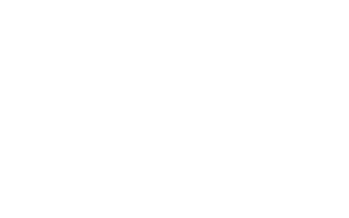

# Robbo for Playdate

A port of **Robbo** (the 1993 MS-DOS edition) to the [Playdate](https://play.date).
The game is reconstructed in Lua from the original DOS C source, reproducing the
original mechanics, level data, and feel — right down to its deliberate **~7.5 fps**
cave logic and vertically-scrolling viewport.

Robbo is a grid puzzle: guide the little robot around each planet, push boxes,
shoot your way past guards and turrets with limited ammo, collect every screw to
open the exit capsule, then step into it to clear the planet.



## Download

Build the `.pdx` yourself (see [Building](#building)) and sideload it to your
Playdate, or run it in the Playdate Simulator.

## About Robbo

Robbo was created by Polish developer **Janusz Pelc** and originally released for
8-bit Atari computers in 1989 (published by LK Avalon). In 1993 it was rebuilt
for MS-DOS by **xLand Games** and distributed by **Epic MegaGames** (now Epic
Games). This port is reconstructed from that DOS edition's C source.

Robbo is a grid-based puzzle game in the spirit of *Boulder Dash* and *Supaplex*,
but built around shooting and exploration rather than gravity. Across 60 planets
the player must collect every screw to unlock the exit while contending with
patrolling guards, bouncing bats, stationary and rotating guns, lasers and
blasters, magnets, teleports, locked doors, bombs, and pushable boxes — all
driven by a single cellular grid update that ticks every object in a fixed order.

## Status

Playable across all **60 planets** of the full edition. Implemented:

- **Rendering** — the original 16×31 cave grid drawn as 16×16 1-bit tiles, with
  the authentic **10-row vertically-scrolling viewport** (only part of the planet
  is visible at once — itself a puzzle mechanic), a 256×160 playfield centred on
  the screen, and a bottom HUD (cave, screws, ammo, keys, lives).
- **Simulation** — the full per-object engine ported from `PLAY.CPP`: guards and
  bats, fixed / moving / rotating guns, lasers and blasters and their shots,
  bombs and chain explosions, magnets, teleports, doors and keys, capsules/exit,
  barriers, and the random "extra" surprise contents — all updated in the
  original cell order with the original `explode` / `shoot` / `kill` interaction
  tables.
- **Hero** — walk, push boxes, fire ammo in four directions (hold a direction +
  Ⓐ), collect screws / keys / ammo, pick up extra lives, self-destruct, and exit
  through the opened capsule.
- **Flow** — sequential progression through the 60 planets; clearing a planet
  advances to the next, dying retries the current one until lives run out.
- **Progress** — the last finished planet is saved to the datastore; a new game
  resumes at the first unfinished planet, and *reset progress* clears the record
  from the system menu.
- **Timing** — locked to the original **~7.5 Hz** cave logic (the DOS engine ran
  its sim once per 8 VGA vertical retraces; here a fixed timestep steps the sim
  every 4th 30 fps frame).
- **Title & credits** — the converted TITLE art with the original fly-in credit
  animation (a port of `scroll_in` / `scroll_out`), ending on a *press any button
  to play* prompt.
- **Sound** — the original `.SND` effect samples at every event, plus the title,
  *kodowa*, completion, and game-over music tracks.

## Controls

| Input | Action |
| --- | --- |
| Any button | Start the game (on the title screen) |
| D-pad | Move Robbo — walk, push boxes, collect |
| Ⓐ + D-pad | Fire in the held direction (costs ammo) |
| Ⓑ | Self-destruct — restart the current planet |
| Ⓐ | Return to the title (on the completion / game-over screen) |
| System menu → *reset progress* | Clear the saved planet progress |

Collect every screw to open the exit capsule, then walk into it to clear the planet.

## Building

Requires the [Playdate SDK](https://play.date/dev/) (which provides `pdc`).

```powershell
# from the repository root
pdc source Robbo.pdx
```

Then open `Robbo.pdx` in the Playdate Simulator (or sideload it to a device).

## Running on a Playdate

1. Build `Robbo.pdx` as above.
2. Upload it through the [Playdate sideload page](https://play.date/account/sideload/)
   (a Playdate account is required), then install it to your device from
   *Settings → Games*.

## Project structure

```
source/
  main.lua         entry point — boots CoreLibs, hands off to the game loop
  game.lua         top-level state machine (title / play / complete / over),
                   input, flow, and inter-cave transitions
  cave.lua         the 16x31 cave grid model + gameplay engine (Cave:step)
  caves.lua        the 60 baked cave definitions (decoded from CAVES.DTA)
  objects.lua      per-object interaction tables (explode / shoot / kill)
  constants.lua    grid, screen layout, timing, and the OBJ / STAT enums
  defs.lua         object -> sprite-bank tile indices + per-group wall/box art
  render.lua       map rendering, the scrolling viewport, and the HUD
  title.lua        title screen + fly-in credits
  sounds.lua       sound-effect + music engine
  sound_data.lua   per-effect playback priorities
  save.lua         progress persistence (last finished planet, via datastore)
  images/          bank sprite table, credit-letter table, title / end art
  music/           title, kodowa, completion, and game-over music (WAV)
  sounds/          the converted .SND effect samples (WAV)
  pdxinfo          bundle metadata
```

The 1-bit sprite tables and screen art were converted from the original game's
`.GGS` sprite data, the cave definitions decoded from `CAVES.DTA`, and the effect
samples converted from its `.SND` data. The asset-conversion tooling and the
original C source live in a separate development repository.

## License

- **Port code** — everything under `source/*.lua` — is licensed under the **MIT
  License**. See [LICENSE](LICENSE).
- **Game data, graphics, and sound** — the sprite/art tables in `source/images/`,
  the baked cave definitions in `source/caves.lua`, and the effect and music
  samples in `source/sounds/` and `source/music/` — are converted from the
  original **Robbo** (1993) and remain the property of their original authors;
  they are included here for this non-commercial fan port under the terms of the
  original game's source release.

## Acknowledgments

- **Robbo** and its author **Janusz Pelc**, for the original 1989 Atari game and
  its design.
- **xLand Games** and **Epic MegaGames**, for the 1993 MS-DOS edition, and for
  the later release of its source — used here as the reference implementation for
  the mechanics, timing, and data formats.
- Playdate port by [Claude Code](https://claude.com/claude-code) under the
  supervision of [Maciej Miąsik](https://github.com/tosiabunio)
  ([miasik.net](https://miasik.net/)).
